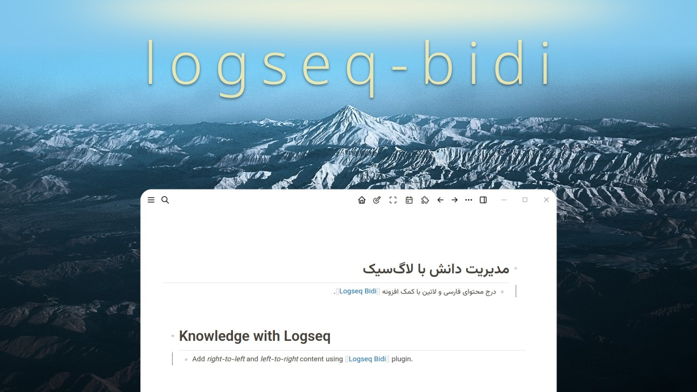

# Logseq Bidirectional Text Plugin

This plugin adds support for bidirectional text to the Logseq graph. By activating
this plugin, regardless of the overall direction of the whole graph, the
content in any block gets rendered in the same direction associated with the
first strong character of that block. This helps to have graphs containing
RTL and LTR content.

## Installation
Install from the marketplace within the Logseq plugins section.

## Usage
Just install and it works!
logseq-bidi is a passive plugin, there is no need for the user to take any action or do any configuration.

## Development
- Clone this repo
- Run `npm install`
- Run `npm run watch` and apply changes (in `./index.js`)
- Load the plugin in the plugins section using the "Load unpacked plugin" button and open the project's directory
- After every change in development, reload the plugin in the plugin section (or if needed, hard reload Logseq using `Ctrl+R`)
- Before committing changes, use `npm run lint` to check the integrity of the code based on the linter configuration.

## License
This project is released under the [AGPL-3.0](https://github.com/dobidi/logseq-bidi/blob/main/LICENSE) license.
